# ClubMaster | 松露

ClubMaster: Club management system for club creators and members. We currently provide interface in Chinese and the English interface is under development.

松露：社团管理系统，支持社长和社员。目前仅支持中文。

## Overview | 简介

ClubMaster is a backend management system for you to create & join in clubs and enjoy fun events. The built-in recommendation system will advertise clubs and users that share your interests.

松露是一个后台管理系统，用于创建/加入社团和参加丰富有趣的活动。内置的推荐系统会根据您的兴趣向您推送社团和用户。

## Features | 功能

- Homepage | 主页

  - Sign up and sign in | 注册和登录
    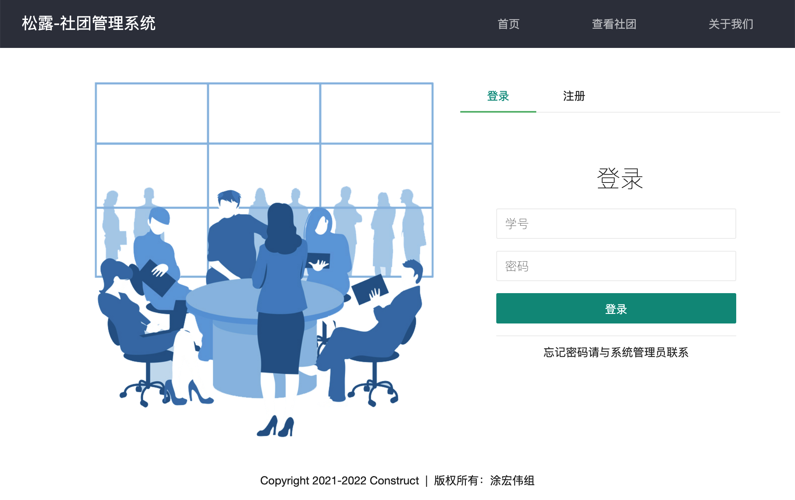

  - View clubs | 查看社团
    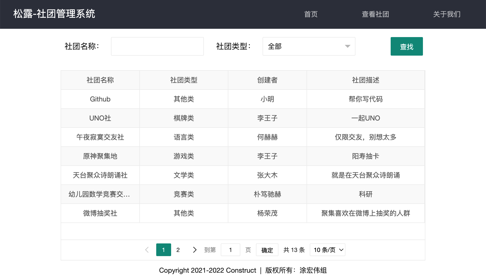

  - See stats | 查看统计数据
    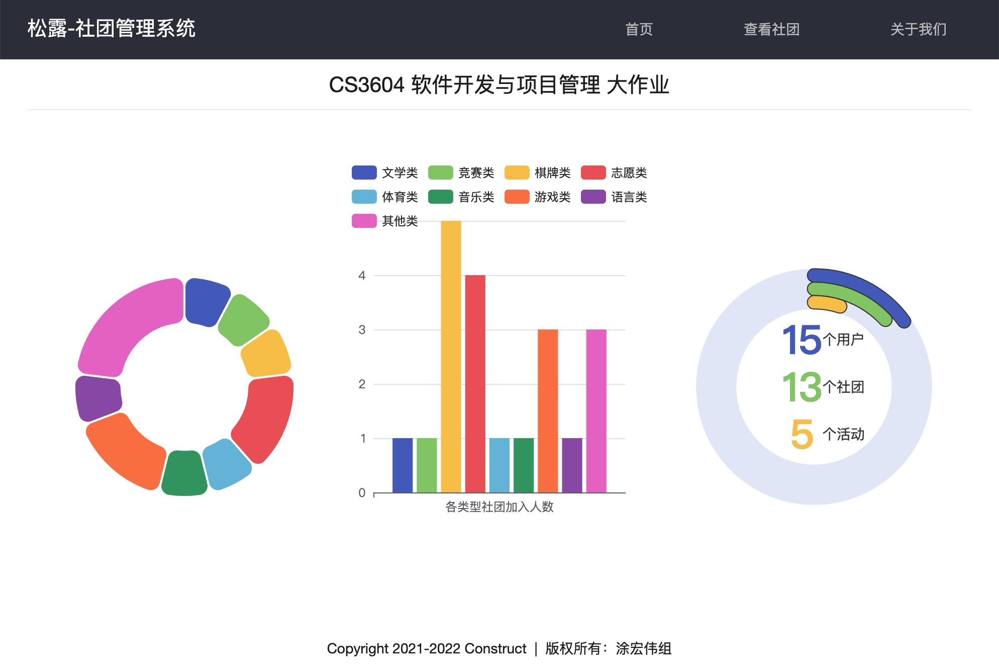

- Backend | 后台

  - Welcome page | 欢迎页面
    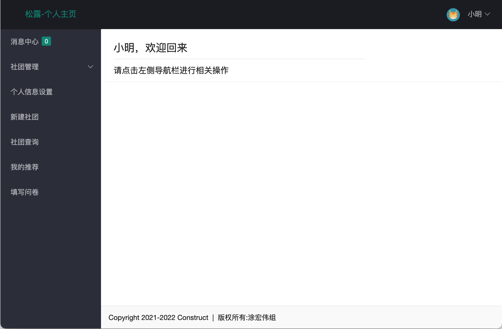

  - Check out messages and respond to them | 查看消息并回复
    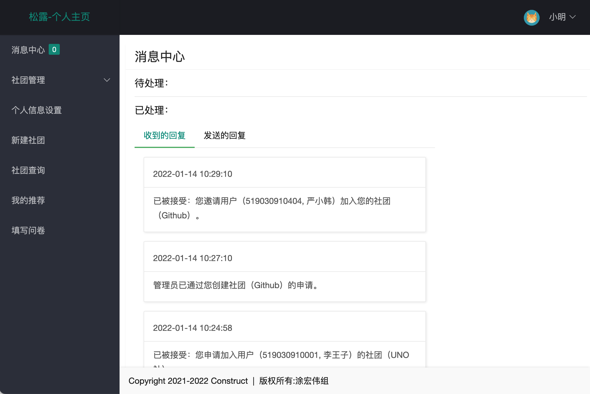

  - Search clubs in our system | 查找所有社团
    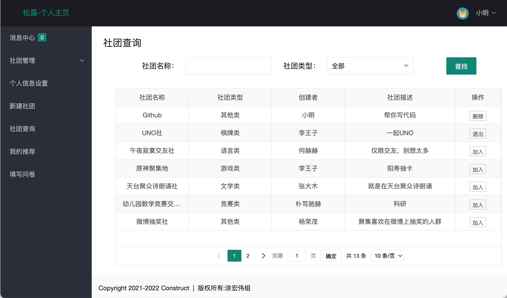

  - Start a new club | 创建新社团
    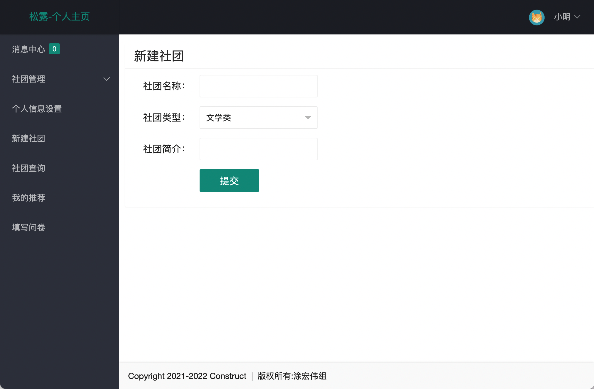

  - Manage your club | 管理社团
    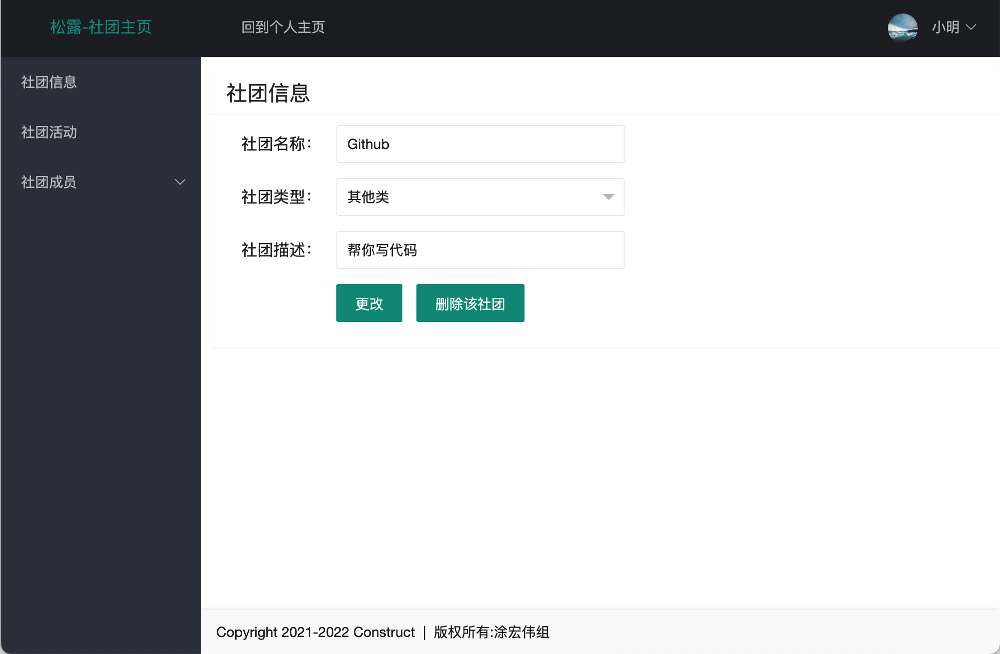

  - Manage events in your club | 管理社团活动
    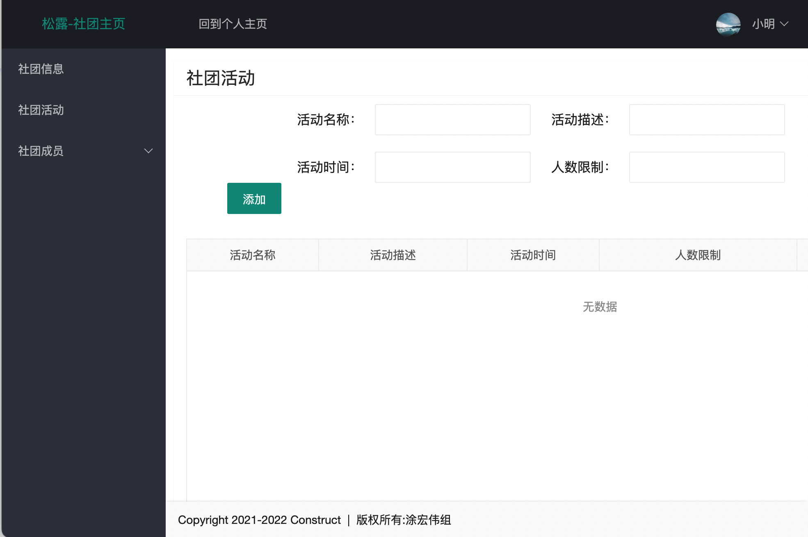

  - Manage members in your club | 管理社团成员
    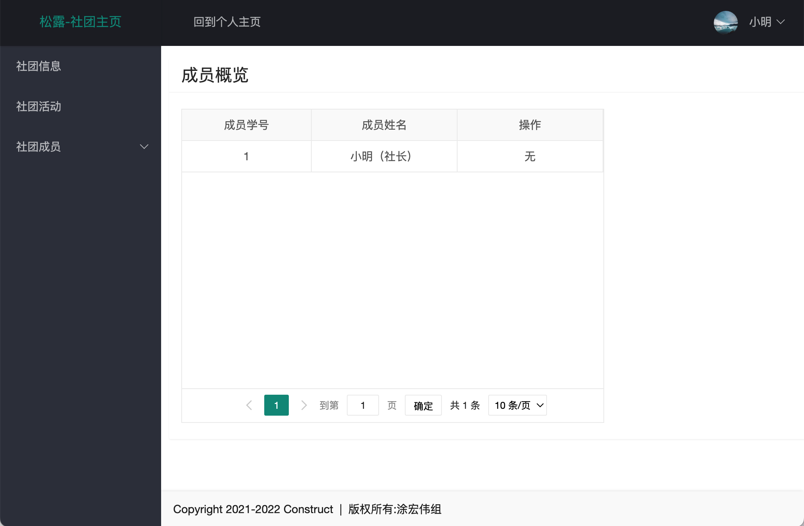

  - Fill out a questionnaire to find your interests | 填写问卷以发现兴趣
    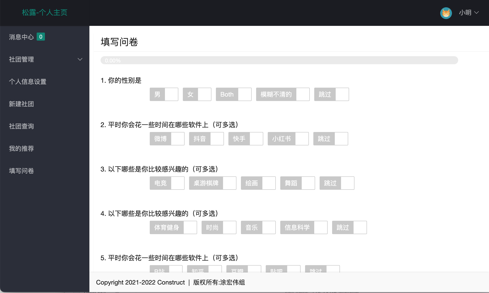
    - Our recommendation system will advertise clubs and users to you based on the questionnaire and your past activity.
    - 我们的推荐系统会根据此问卷和您的使用记录推荐与您相关的社团和用户。

  - Check out clubs and users advertised by our recommendation system | 查看由推荐系统推送的社团和用户
    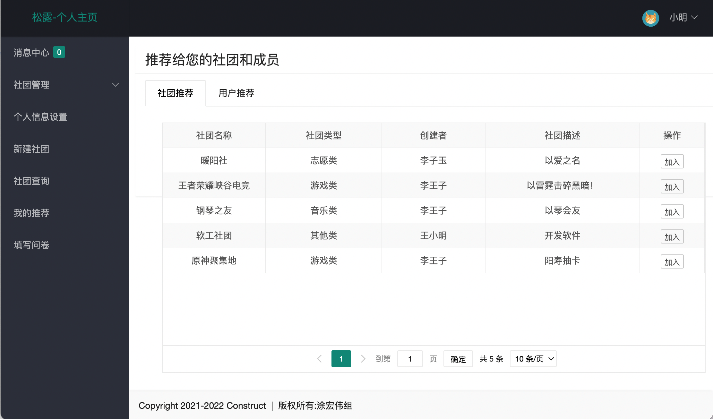

## Usage | 用法

1. Set up an environment with pip according to [requierments.txt](requirements.txt). ｜ 使用pip根据requirements.txt搭建环境。

2. Type the following in a terminal: ｜ 在命令行中输入以下内容：

```bash
flask run
```

3. Go to <http://127.0.0.1:5000/> (in most cases, otherwise check the terminal). ｜ 跳转至<http://127.0.0.1:5000/>（大多数情况下如此，其它情况下查看命令行的具体内容）。

## Acknowledgements | 致谢

ClubMaster was built with [Flask](https://palletsprojects.com/p/flask/) & [SQLAlchemy](https://sqlalchemy.org) for the backend and [jQuery](https://jquery.com/) & [LayUI](https://layui.itze.cn/) for the frontend.

松露使用[Flask](https://palletsprojects.com/p/flask/)和[SQLAlchemy](https://sqlalchemy.org)搭建后端，使用[jQuery](https://jquery.com/)和[LayUI](https://layui.itze.cn/)搭建前端。
